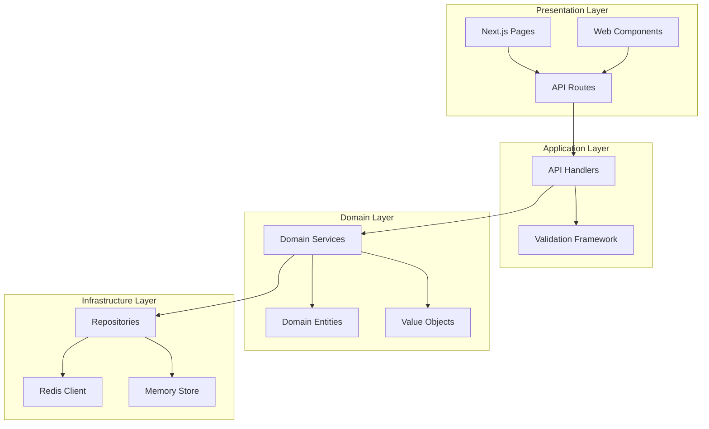
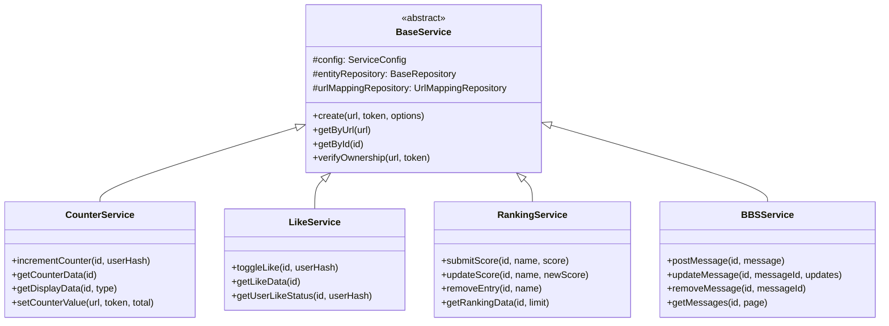
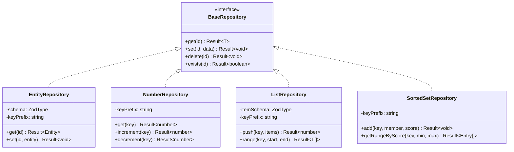
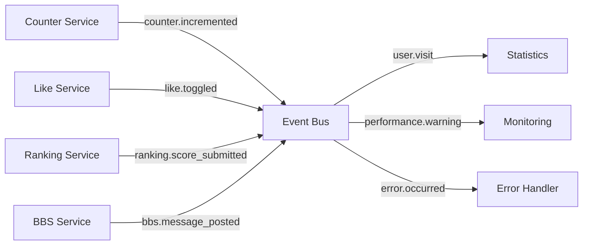
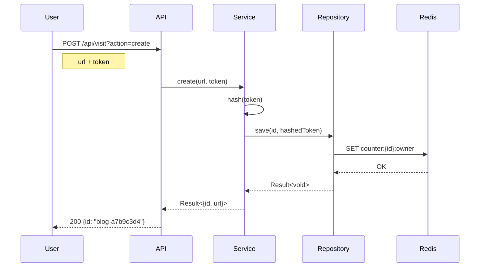
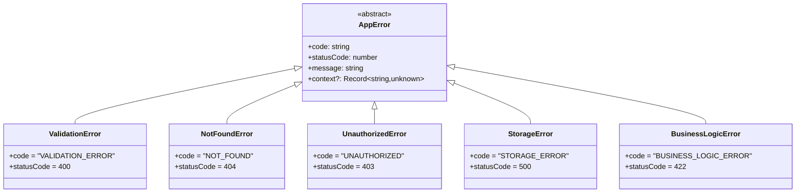

# Nostalgic Platform - DDD Architecture Documentation

## 概要

Nostalgic Platformは、1990年代後半のWebツール（カウンター、いいねボタン、ランキング、掲示板）を最新技術で復活させたサービスです。Domain-Driven Design (DDD) アーキテクチャを採用し、100%型安全なTypeScriptで実装されています。

## アーキテクチャ図

### レイヤード・アーキテクチャ



### ドメインサービス構成



## ディレクトリ構造

```
src/
├── app/                      # Next.js App Router
│   ├── api/                  # API Routes
│   │   ├── visit/            # Counter API
│   │   ├── like/             # Like API
│   │   ├── ranking/          # Ranking API
│   │   ├── bbs/              # BBS API
│   │   └── admin/            # Admin API
│   │       └── cleanup/
│   └── (pages)/             # フロントエンドページ
│
├── domain/                   # ドメイン層
│   ├── counter/
│   │   ├── counter.entity.ts
│   │   └── counter.service.ts
│   ├── like/
│   │   ├── like.entity.ts
│   │   └── like.service.ts
│   ├── ranking/
│   │   ├── ranking.entity.ts
│   │   └── ranking.service.ts
│   └── bbs/
│       ├── bbs.entity.ts
│       └── bbs.service.ts
│
├── lib/
│   ├── core/                # コアライブラリ
│   │   ├── api-handler.ts   # APIハンドラー基底
│   │   ├── app.ts          # アプリケーション初期化
│   │   ├── auth.ts         # 認証
│   │   ├── base-service.ts # サービス基底クラス
│   │   ├── config.ts       # 設定管理
│   │   ├── db.ts           # データベース接続
│   │   ├── event-bus.ts    # イベント駆動
│   │   ├── id.ts           # ID生成
│   │   ├── repository.ts   # リポジトリパターン
│   │   ├── result.ts       # Result型
│   │   └── validation.ts   # バリデーション
│   │
│   ├── validation/         # バリデーション関連
│   │   └── service-schemas.ts # サービス別アクションスキーマ
│   │
│   └── utils/              # ユーティリティ
│       ├── api.ts
│       ├── cors.ts
│       ├── redis-keys.ts
│       └── ttl-constants.ts
```

## Result型パターン

エラーハンドリングには`Result<T, E>`型を使用し、例外を投げない設計です。

```typescript
type Result<T, E = AppError> = Success<T> | Failure<E>

interface Success<T> {
  readonly success: true
  readonly data: T
}

interface Failure<E> {
  readonly success: false
  readonly error: E
}
```

### 使用例

```typescript
async function incrementCounter(id: string): Result<CounterData, AppError> {
  const counterResult = await this.entityRepository.get(id)
  if (!counterResult.success) {
    return counterResult
  }
  
  const incrementResult = await this.numberRepository.increment('total')
  if (!incrementResult.success) {
    return incrementResult
  }
  
  return Ok({
    id,
    total: incrementResult.data,
    // ...
  })
}
```

## Repository パターン

データアクセスは Repository パターンで抽象化されています。



## Redis キー設計

```
# Counter Service
counter:{id}                  # メタデータ
counter:{id}:total           # 累計カウント
counter:{id}:daily:{date}    # 日別カウント
counter:{id}:owner           # オーナートークン（ハッシュ化）
visit:counter:{id}:{hash}    # 重複防止（24h TTL）

# Like Service  
like:{id}                    # メタデータ
like:{id}:total             # いいね総数
like:{id}:users:{hash}      # ユーザー状態（24h TTL）
like:{id}:owner             # オーナートークン

# Ranking Service
ranking:{id}                 # メタデータ
ranking:{id}:scores         # Sorted Set（スコア）
ranking:{id}:owner          # オーナートークン
ranking:{id}:meta           # 追加メタデータ

# BBS Service
bbs:{id}                    # メタデータ
bbs:{id}:messages          # List（メッセージ）
bbs:{id}:owner             # オーナートークン

# URL Mapping (全サービス共通)
url:counter:{encoded_url}   # URL → ID マッピング
url:like:{encoded_url}
url:ranking:{encoded_url}
url:bbs:{encoded_url}
```

## エンティティ定義（Zod スキーマ）

### CounterEntity

```typescript
const CounterEntitySchema = z.object({
  id: z.string(),
  url: z.string().url(),
  created: z.date(),
  enableDailyStats: z.boolean().default(true)
})

const CounterDataSchema = z.object({
  id: z.string(),
  url: z.string().url(),
  total: z.number().int().min(0),
  today: z.number().int().min(0),
  yesterday: z.number().int().min(0),
  week: z.number().int().min(0),
  month: z.number().int().min(0),
  created: z.string(),
  lastUpdated: z.string()
})
```

### LikeEntity

```typescript
const LikeEntitySchema = z.object({
  id: z.string(),
  url: z.string().url(),
  created: z.date(),
  lastLike: z.date()
})

const LikeDataSchema = z.object({
  id: z.string(),
  url: z.string().url(),
  total: z.number().int().min(0),
  userLiked: z.boolean(),
  created: z.string(),
  lastLike: z.string()
})
```

### RankingEntity

```typescript
const RankingEntitySchema = z.object({
  id: z.string(),
  url: z.string().url(),
  created: z.date(),
  maxEntries: z.number().int().min(1).max(100).default(10),
  orderBy: z.enum(['desc', 'asc']).default('desc')
})

const RankingEntrySchema = z.object({
  name: z.string().min(1).max(50),
  score: z.number().int()
})
```

### BBSEntity

```typescript
const BBSEntitySchema = z.object({
  id: z.string(),
  url: z.string().url(),
  created: z.date(),
  messagesPerPage: z.number().int().min(1).max(50).default(10),
  maxMessages: z.number().int().min(1).max(1000).default(100),
  settings: BBSSettingsSchema
})

const BBSMessageSchema = z.object({
  id: z.string(),
  author: z.string().min(1).max(50),
  message: z.string().min(1).max(1000),
  icon: z.string().optional(),
  selects: z.record(z.string()).optional(),
  ipHash: z.string().optional(),
  userAgent: z.string().optional(),
  timestamp: z.string()
})
```

## イベント駆動アーキテクチャ



### イベント定義

```typescript
const Events = {
  // Counter
  COUNTER_CREATED: 'counter.created',
  COUNTER_INCREMENTED: 'counter.incremented',
  COUNTER_VALUE_SET: 'counter.value_set',
  
  // Like
  LIKE_CREATED: 'like.created',
  LIKE_TOGGLED: 'like.toggled',
  
  // Ranking
  RANKING_CREATED: 'ranking.created',
  RANKING_SCORE_SUBMITTED: 'ranking.score_submitted',
  RANKING_SCORE_UPDATED: 'ranking.score_updated',
  
  // BBS
  BBS_CREATED: 'bbs.created',
  BBS_MESSAGE_POSTED: 'bbs.message_posted',
  BBS_MESSAGE_UPDATED: 'bbs.message_updated',
  BBS_MESSAGE_REMOVED: 'bbs.message_removed',
  
  // System
  USER_VISIT: 'user.visit',
  PERFORMANCE_WARNING: 'system.performance_warning',
  ERROR_OCCURRED: 'system.error'
}
```

## 設定管理

環境変数を使わず、コード内で設定を管理：

```typescript
interface Config {
  serviceLimits: {
    counter: { maxTotal: number; maxDailyData: number }
    like: { maxTotal: number; userStateTTL: number }
    ranking: { maxEntries: number; maxNameLength: number }
    bbs: { maxMessages: number; maxMessageLength: number }
  }
  cache: {
    enabled: boolean
    ttl: { default: number; display: number; urlMapping: number }
  }
  redis: {
    url: string
    options: { maxRetriesPerRequest: number }
  }
  logging: {
    level: 'error' | 'warn' | 'info' | 'debug'
    enablePerformanceLogging: boolean
  }
}
```

## セキュリティ

### 認証フロー



### トークン管理

- オーナートークン: 8-16文字
- SHA256でハッシュ化して保存
- URL + トークンで管理権限を確認

## パフォーマンス最適化

### キャッシュ戦略

1. **URL → ID マッピング**: 永続キャッシュ
2. **表示データ**: 60秒キャッシュ（Cache-Control）
3. **重複防止**: 24時間TTL（Redis）

### バッチ処理

APIハンドラーでバッチ処理をサポート：

```typescript
ApiHandler.createBatch<TParams, TResult>({
  paramsSchema,
  resultSchema,
  handler: async (params) => {
    // 並列処理
  }
})
```

## エラーハンドリング

### エラー階層



## まとめ

このアーキテクチャの特徴：

1. **完全な型安全性**: Zod + TypeScript で実行時・コンパイル時の両方で型安全
2. **エラーハンドリング**: Result型で例外を使わない設計
3. **疎結合**: Repository パターンでインフラ層を抽象化
4. **イベント駆動**: サービス間の連携を疎結合に
5. **キャッシュ最適化**: 多層キャッシュで高速化
6. **セキュリティ**: トークンハッシュ化、重複防止機能

この設計により、保守性・拡張性・パフォーマンスを両立しています。