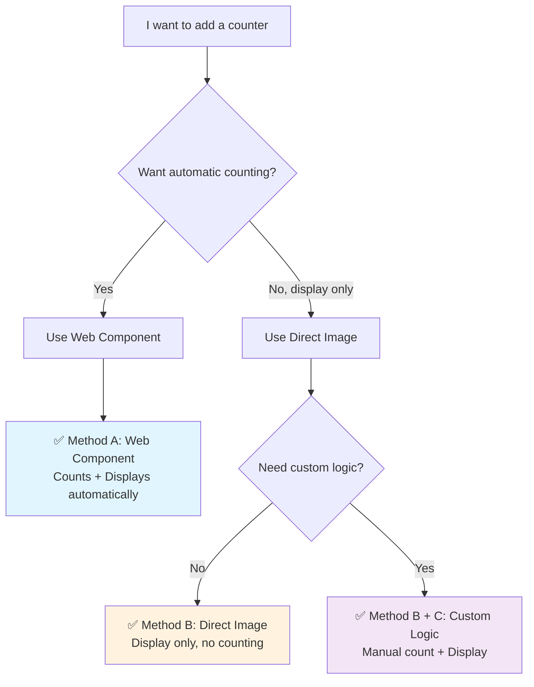

# Nostalgic Counter

*[日本語版はこちら](README_ja.md)*

A nostalgic web counter service that brings back the 90s internet culture with modern technology. Remember those visitor counters that used to be on every personal homepage? Now you can add them to your site with just a few lines of code.

## ✨ Features

- 📊 **Multiple time periods**: Total, today, yesterday, weekly, monthly statistics
- 🚫 **No registration required**: Just provide a URL and secret token
- 🔒 **Duplicate prevention**: 24-hour cooldown per visitor
- 🎨 **3 nostalgic styles**: Classic (green on black), Modern (white on gray), Retro (yellow on purple)
- 🌐 **Easy embedding**: Web Components, direct images, or JavaScript fetch
- ⚡ **Fast & reliable**: Built on Vercel with KV storage

## 🚀 Quick Start

### 1. Get your counter ID

Paste this URL in your browser (replace with your site and secret token):

```
https://nostalgic-counter.vercel.app/api/count?url=https://yoursite.com&token=your-secret-token
```

The browser will show JSON with your public counter ID: `"id": "yoursite-a7b9c3d4"`

**Important**: The `url` parameter is just used as a **counter identifier**, not to track other people's websites. Each URL+token combination creates a separate counter that only you can manage with your secret token. Use different URLs for different pages if you want separate counters (e.g., `https://yoursite.com/blog`, `https://yoursite.com/about`).

*Note: This uses our hosted service. For self-hosting, see the [Service Options](#-service-options) section.*

**💡 Practice Mode**: You can click the example URL above to see how it works! It will create a demo counter that everyone can use for testing. Try management operations too:

```
https://nostalgic-counter.vercel.app/api/owner?action=set&url=https://yoursite.com&token=your-secret-token&total=12345
```

### 2. Choose your integration method



**Method A: Web Component (Recommended - All-in-one)**
```html
<script src="https://nostalgic-counter.vercel.app/components/counter.js"></script>
<nostalgic-counter id="yoursite-a7b9c3d4" type="total" style="classic"></nostalgic-counter>
```

**Method B: Direct Image (Display only)**
```html

```

**Method B + C: Custom Logic (Manual control)**
```javascript
// 1. Count the visit when you want
fetch('https://nostalgic-counter.vercel.app/api/count?id=yoursite-a7b9c3d4')
  .then(response => response.json())
  .then(data => console.log('Current count:', data.total));

// 2. Display the counter image

```

That's it! Your counter will automatically count unique visitors and display the nostalgic counter image.

## 📖 Documentation

- **[API Reference](docs/API.md)** - Complete API documentation
- **[Live Demo](https://nostalgic-counter.vercel.app)** - Try it on our nostalgic homepage

## 🎯 Parameters

### Counter Types
- `total` - All-time visitors (default)
- `today` - Today's visitors  
- `yesterday` - Yesterday's visitors
- `week` - Last 7 days
- `month` - Last 30 days

### Styles
- `classic` - Green text on black background (90s terminal style)
- `modern` - White text on gray background (2000s clean style)
- `retro` - Yellow text on purple background (80s neon style)

## 🔧 Management

Reset or set your counter value:
```
https://nostalgic-counter.vercel.app/api/owner?action=set&url=https://yoursite.com&token=your-secret-token&total=0
```

## 🛡️ Security & Privacy

### What data we collect and store:
- **Counter URL** (identifier only, not used for tracking)
- **Secret token** (hashed with SHA256)
- **Visitor IP address** (temporarily, for 24h duplicate prevention only)
- **User-Agent string** (temporarily, for 24h duplicate prevention only)
- **Visit counts** (numbers only, no personal data)

### What we DON'T collect:
- No cookies, no tracking pixels
- No personal information (name, email, etc.)
- No browsing history or referrer data
- IP addresses are NOT permanently stored

### Security measures:
- Your secret token is hashed and stored securely
- Public counter IDs can only display/count, not modify
- Each visitor is counted once per 24 hours (by IP + User-Agent)
- Token length: 8-16 characters

## ⚠️ Disclaimer

**This is a free hobby project with no warranties:**
- Counters may be reset, lost, or become unavailable at any time
- No guarantee of uptime, accuracy, or data persistence
- Service may be discontinued without notice
- Use at your own risk for non-critical applications only
- For production use, consider [self-hosting](#-service-options)

## 💝 Why Nostalgic Counter?

In the early days of the web (90s-2000s), visitor counters were everywhere - on GeoCities pages, personal blogs, and fan sites. They were a simple way to show "Hey, people actually visit my site!" 

This project brings back that nostalgic feeling with modern, reliable technology. No more broken counter services or lost visitor counts.

## 🌐 Service Options

### Option 1: Use Our Hosted Service (Recommended)

Just use `https://nostalgic-counter.vercel.app` in all the examples above. No setup required!

### Option 2: Self-Hosting (Advanced)

Want your own private counter service? Deploy your own instance:

1. Fork this repository
2. Deploy to Vercel
3. Add Vercel KV storage to your project
4. Replace `nostalgic-counter.vercel.app` with your domain in the examples

**Why self-host?**
- Full control over your data
- Custom domain
- No dependency on our service
- Can modify the code as needed

## 📜 License

MIT License - feel free to use, modify, and distribute.

## 🌟 Contributing

Issues and pull requests are welcome! Let's bring back the nostalgic web together.

---

*Made with ❤️ for the nostalgic web*