# Nostalgic Counter

*[日本語版はこちら](README_ja.md)*

<div align="center">
  
  
  
  <br>
  
  
  
</div>

A nostalgic web counter service that brings back the 90s internet culture with modern technology. Remember those visitor counters that used to be on every personal homepage? Now you can add them to your site with just a few lines of code.

## ✨ Features

- 📊 **Multiple time periods**: Total, today, yesterday, weekly, monthly statistics
- 🚫 **No registration required**: Just provide a URL and secret token
- 🔒 **Duplicate prevention**: 24-hour cooldown per visitor
- 🎨 **3 nostalgic styles**: Classic (green on black), Modern (white on gray), Retro (yellow on purple)
- 🌐 **Easy embedding**: Web Components, direct images, or JavaScript fetch
- ⚡ **Fast & reliable**: Built on Vercel with Redis storage

## 🚀 Quick Start

### 1. Get your counter ID

Paste this URL in your browser (replace with your site and secret token):

```
https://nostalgic-counter.llll-ll.com/api/count?url=https://yoursite.com&token=your-secret-token
```

The browser will show JSON with your public counter ID: `"id": "yoursite-a7b9c3d4"`

### 2. Choose how to use

```mermaid
flowchart TD
    A[I want to add a counter] --> B{Use hosted service or self-host?}
    B -->|Use hosted service| C[Use nostalgic-counter.llll-ll.com]
    B -->|Self-host| D[Deploy your own to Vercel]
    
    C --> E[Add to your website]
    D --> E
    
    E --> F{Integration method?}
    F -->|Simple| G[✅ Web Component<br/>Auto count + display]
    F -->|Custom| H[✅ Manual Control<br/>JavaScript + img tag]
    
    style G stroke:#2196F3,stroke-width:2px
    style H stroke:#FF9800,stroke-width:2px
```



**Web Component (Simple)**
```html
<script src="https://nostalgic-counter.llll-ll.com/components/display.js"></script>
<nostalgic-counter id="yoursite-a7b9c3d4" type="total" style="classic"></nostalgic-counter>
```

**Manual Control (Custom)**
```html
<!-- Display counter as image only (no automatic counting) -->


<!-- Or count manually with JavaScript -->
<script>
  // Count and display current value
  fetch('https://nostalgic-counter.llll-ll.com/api/count?id=yoursite-a7b9c3d4')
    .then(response => response.json())
    .then(data => console.log('Current count:', data.total));
</script>
```

That's it! Your counter will automatically count unique visitors and display the nostalgic counter image.

### Service Options

**Hosted Service (Recommended)**: Just use `https://nostalgic-counter.llll-ll.com` in the examples above. No setup required!

**Self-Hosting**: Want your own? Fork this repo and deploy to Vercel. Web Components will automatically use your domain.

## 📖 Documentation

- **[API Reference](docs/API.md)** - Complete API documentation
- **[Live Demo](https://nostalgic-counter.llll-ll.com)** - Try it on our nostalgic homepage


## 🛡️ Security & Privacy

### What data we collect and store:
- **Counter URL** (identifier only, not used for tracking)
- **Secret token** (hashed with SHA256)
- **Visitor IP address** (temporarily, for 24h duplicate prevention only)
- **User-Agent string** (temporarily, for 24h duplicate prevention only)
- **Visit counts** (numbers only, no personal data)

### What we DON'T collect:
- No cookies, no tracking pixels
- No personal information (name, email, etc.)
- No browsing history or referrer data
- IP addresses are NOT permanently stored

### Security measures:
- Your secret token is hashed and stored securely
- Public counter IDs can only display/count, not modify
- Each visitor is counted once per 24 hours (by IP + User-Agent)
- Token length: 8-16 characters

## ⚠️ Disclaimer

**This is a free hobby project with no warranties:**
- Counters may be reset, lost, or become unavailable at any time
- No guarantee of uptime, accuracy, or data persistence
- Service may be discontinued without notice
- Use at your own risk for non-critical applications only
- For production use, consider [self-hosting](#-service-options)


## 📜 License

MIT License - feel free to use, modify, and distribute.

## 🌟 Contributing

Issues and pull requests are welcome! Let's bring back the nostalgic web together.

---

*Made with ❤️ for the nostalgic web*