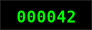
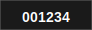
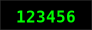
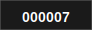
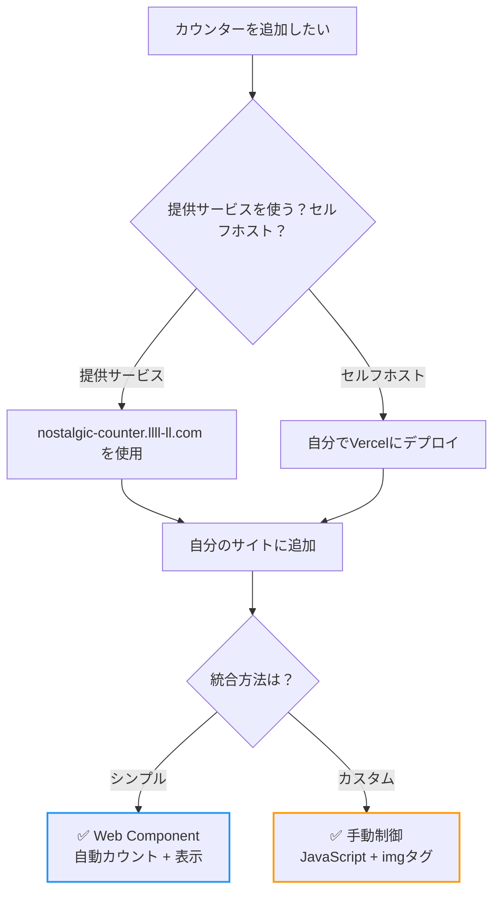

# Nostalgic Counter

*[English version here](README.md)*

<div align="center">
  
  
  
  <br>
  
  
  
</div>

90年代のインターネット文化を最新技術で復活させた懐かしいWebカウンターサービスです。昔の個人ホームページによくあった訪問者カウンター、覚えていますか？今なら数行のコードで簡単にあなたのサイトに追加できます。

## ✨ 特徴

- 📊 **複数の期間統計**: 累計・今日・昨日・週間・月間の表示
- 🚫 **登録不要**: URLと秘密トークンだけで利用開始
- 🔒 **重複防止**: 訪問者ごとに24時間のクールダウン
- 🎨 **3つのノスタルジックスタイル**: クラシック（黒背景に緑文字）、モダン（グレー背景に白文字）、レトロ（紫背景に黄文字）
- 🌐 **簡単埋め込み**: Web Components、直接画像、またはJavaScriptで
- ⚡ **高速・安定**: Vercel + KVストレージで構築

## 🚀 クイックスタート

### 1. カウンターIDを取得

ブラウザのアドレスバーに以下のURLを入力（あなたのサイトと秘密トークンに置き換え）：

```
https://nostalgic-counter.llll-ll.com/api/count?url=https://yoursite.com&token=your-secret-token
```

ブラウザにJSONが表示され、公開カウンターIDが確認できます: `"id": "yoursite-a7b9c3d4"`

### 2. 使用方法を選択



**Web Component（シンプル）**
```html
<script src="https://nostalgic-counter.llll-ll.com/components/display.js"></script>
<nostalgic-counter id="yoursite-a7b9c3d4" type="total" style="classic"></nostalgic-counter>
```

**手動制御（カスタム）**
```javascript
// 1. 訪問をカウント
fetch('https://nostalgic-counter.llll-ll.com/api/count?id=yoursite-a7b9c3d4')
  .then(response => response.json())
  .then(data => console.log('現在のカウント:', data.total));

// 2. カウンターを表示

```

これだけです！あなたのカウンターが自動的にユニーク訪問者をカウントし、懐かしいカウンター画像を表示します。

### サービス利用オプション

**提供サービス（推奨）**: 上記の例で `https://nostalgic-counter.llll-ll.com` をそのまま使用。設定不要！

**セルフホスティング**: 自分専用が欲しい場合は、このリポジトリをフォークしてVercelにデプロイ。Web Componentが自動で自分のドメインを使用します。

## 📖 ドキュメント

- **[API仕様書](docs/API.md)** - 完全なAPI仕様
- **[ライブデモ](https://nostalgic-counter.llll-ll.com)** - 懐かしいホームページで実際に体験


## 🛡️ セキュリティとプライバシー

### 収集・保存するデータ：
- **カウンターURL**（識別子のみ、追跡には使用しません）
- **秘密トークン**（SHA256でハッシュ化）
- **訪問者のIPアドレス**（24時間の重複防止のみ、一時的）
- **User-Agent文字列**（24時間の重複防止のみ、一時的）
- **訪問回数**（数値のみ、個人情報なし）

### 収集しないデータ：
- Cookie、トラッキングピクセルは使用しません
- 個人情報（名前、メールアドレスなど）
- 閲覧履歴やリファラー情報
- IPアドレスの永続的な保存はしません

### セキュリティ対策：
- 秘密トークンはハッシュ化して安全に保存
- 公開カウンターIDでは表示・カウントのみ可能、変更不可
- 各訪問者は24時間に1回のみカウント（IP + User-Agent）
- トークン長：8-16文字

## ⚠️ 免責事項

**これは無保証の個人プロジェクトです：**
- カウンターはいつでもリセット、消失、利用不可になる可能性があります
- 稼働時間、精度、データ保持の保証はありません
- 予告なくサービスを終了する場合があります
- 重要でない用途にのみ、自己責任でご利用ください
- 本格運用には[セルフホスティング](#-サービス利用方法)をご検討ください


## 📜 ライセンス

MIT License - 自由に使用、変更、配布できます。

## 🌟 コントリビューション

IssueやPull Requestを歓迎します！一緒に懐かしいWebを復活させましょう。

---

*懐かしいWebへの愛を込めて ❤️*