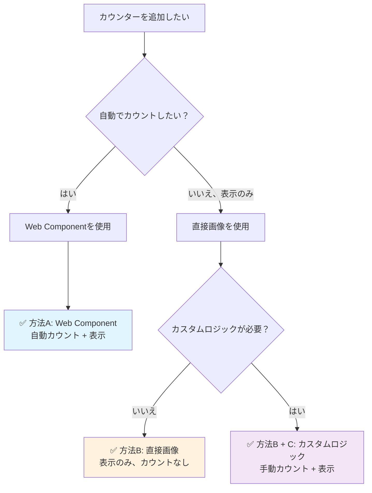

# Nostalgic Counter

*[English version here](README.md)*

90年代のインターネット文化を最新技術で復活させた懐かしいWebカウンターサービスです。昔の個人ホームページによくあった訪問者カウンター、覚えていますか？今なら数行のコードで簡単にあなたのサイトに追加できます。

## ✨ 特徴

- 📊 **複数の期間統計**: 累計・今日・昨日・週間・月間の表示
- 🚫 **登録不要**: URLと秘密トークンだけで利用開始
- 🔒 **重複防止**: 訪問者ごとに24時間のクールダウン
- 🎨 **3つのノスタルジックスタイル**: クラシック（黒背景に緑文字）、モダン（グレー背景に白文字）、レトロ（紫背景に黄文字）
- 🌐 **簡単埋め込み**: Web Components、直接画像、またはJavaScriptで
- ⚡ **高速・安定**: Vercel + KVストレージで構築

## 🚀 クイックスタート

### 1. カウンターIDを取得

ブラウザのアドレスバーに以下のURLを入力（あなたのサイトと秘密トークンに置き換え）：

```
https://nostalgic-counter.vercel.app/api/count?url=https://yoursite.com&token=your-secret-token
```

ブラウザにJSONが表示され、公開カウンターIDが確認できます: `"id": "yoursite-a7b9c3d4"`

**重要**: `url`パラメータは**カウンターの識別子**として使用されるだけで、他人のWebサイトを追跡するものではありません。URL+トークンの組み合わせごとに別々のカウンターが作成され、あなたの秘密トークンでのみ管理できます。異なるページに別々のカウンターが欲しい場合は、異なるURLを使用してください（例：`https://yoursite.com/blog`、`https://yoursite.com/about`）。

*注意: これは提供サービスを使用しています。セルフホスティングについては[サービス利用方法](#-サービス利用方法)の章をご覧ください。*

**💡 練習モード**: 上記のサンプルURLをクリックして動作を確認できます！みんなでテスト用に使えるデモカウンターが作成されます。管理操作も試してみてください：

```
https://nostalgic-counter.vercel.app/api/owner?action=set&url=https://yoursite.com&token=your-secret-token&total=12345
```

### 2. 統合方法を選択



**方法A: Web Component（推奨 - オールインワン）**
```html
<script src="https://nostalgic-counter.vercel.app/components/counter.js"></script>
<nostalgic-counter id="yoursite-a7b9c3d4" type="total" style="classic"></nostalgic-counter>
```

**方法B: 直接画像（表示のみ）**
```html

```

**方法B + C: カスタムロジック（手動制御）**
```javascript
// 1. 好きなタイミングで訪問をカウント
fetch('https://nostalgic-counter.vercel.app/api/count?id=yoursite-a7b9c3d4')
  .then(response => response.json())
  .then(data => console.log('現在のカウント:', data.total));

// 2. カウンター画像を表示

```

これだけです！あなたのカウンターが自動的にユニーク訪問者をカウントし、懐かしいカウンター画像を表示します。

## 📖 ドキュメント

- **[API仕様書](docs/API.md)** - 完全なAPI仕様
- **[ライブデモ](https://nostalgic-counter.vercel.app)** - 懐かしいホームページで実際に体験

## 🎯 パラメータ

### カウンタータイプ
- `total` - 累計訪問者（デフォルト）
- `today` - 今日の訪問者
- `yesterday` - 昨日の訪問者
- `week` - 直近7日間
- `month` - 直近30日間

### スタイル
- `classic` - 黒背景に緑文字（90年代ターミナル風）
- `modern` - グレー背景に白文字（2000年代クリーン風）
- `retro` - 紫背景に黄文字（80年代ネオン風）

## 🔧 管理

カウンター値のリセットや設定：
```
https://nostalgic-counter.vercel.app/api/owner?action=set&url=https://yoursite.com&token=your-secret-token&total=0
```

## 🛡️ セキュリティとプライバシー

### 収集・保存するデータ：
- **カウンターURL**（識別子のみ、追跡には使用しません）
- **秘密トークン**（SHA256でハッシュ化）
- **訪問者のIPアドレス**（24時間の重複防止のみ、一時的）
- **User-Agent文字列**（24時間の重複防止のみ、一時的）
- **訪問回数**（数値のみ、個人情報なし）

### 収集しないデータ：
- Cookie、トラッキングピクセルは使用しません
- 個人情報（名前、メールアドレスなど）
- 閲覧履歴やリファラー情報
- IPアドレスの永続的な保存はしません

### セキュリティ対策：
- 秘密トークンはハッシュ化して安全に保存
- 公開カウンターIDでは表示・カウントのみ可能、変更不可
- 各訪問者は24時間に1回のみカウント（IP + User-Agent）
- トークン長：8-16文字

## ⚠️ 免責事項

**これは無保証の個人プロジェクトです：**
- カウンターはいつでもリセット、消失、利用不可になる可能性があります
- 稼働時間、精度、データ保持の保証はありません
- 予告なくサービスを終了する場合があります
- 重要でない用途にのみ、自己責任でご利用ください
- 本格運用には[セルフホスティング](#-サービス利用方法)をご検討ください

## 💝 なぜNostalgic Counter？

Web初期の時代（90年代〜2000年代）、訪問者カウンターはどこにでもありました。GeoCitiesのページ、個人ブログ、ファンサイトなど。「おお、私のサイトに人が来てる！」を示すシンプルな方法でした。

このプロジェクトは、その懐かしい気持ちを現代の信頼できる技術で蘇らせます。もう壊れたカウンターサービスや失われた訪問者数に悩む必要はありません。

## 🌐 サービス利用方法

### 方法1: 提供サービスを利用（推奨）

上記の例で `https://nostalgic-counter.vercel.app` をそのまま使用してください。設定不要です！

### 方法2: セルフホスティング（上級者向け）

自分専用のカウンターサービスが欲しい場合：

1. このリポジトリをフォーク
2. Vercelにデプロイ
3. プロジェクトにVercel KVストレージを追加
4. 例の中の `nostalgic-counter.vercel.app` を自分のドメインに置き換え

**セルフホスティングのメリット:**
- データの完全管理
- 独自ドメイン
- 提供サービスへの依存なし
- コードの自由な改変が可能

## 📜 ライセンス

MIT License - 自由に使用、変更、配布できます。

## 🌟 コントリビューション

IssueやPull Requestを歓迎します！一緒に懐かしいWebを復活させましょう。

---

*懐かしいWebへの愛を込めて ❤️*